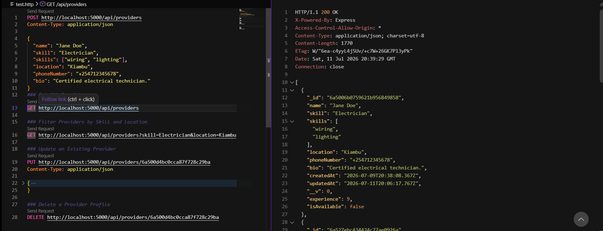
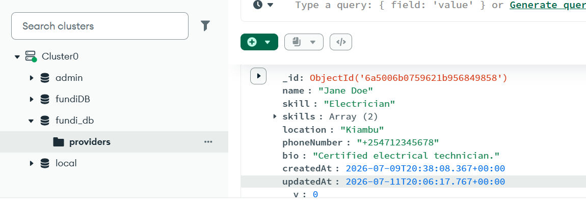

# FundiApp Backend API 🖥️

This repository manages the robust backend architecture for FundiApp. Built using Node.js and Express, it serves as a secure RESTful API that interfaces with a MongoDB Atlas cloud database to deliver verified service provider data to the client application.

## ⚙️ Architecture & Design
* **RESTful API Structure:** Clean endpoint routes separating route management from business logic.
* **Mongoose Schema Architecture:** Strict data modeling using Mongoose to enforce data integrity for provider documents.
* **Asynchronous Controllers:** High-performance asynchronous JavaScript controllers managing CRUD operations.
* **Environment Security:** Complete separation of runtime variables and database keys using hidden configurations.

## 🛠️ API Endpoints

### Service Providers
* `GET /api/providers` - Fetches all verified service providers from the database.
* `POST /api/providers` - Registers a new service provider profile.

## 💻 Tech Stack
* **Runtime:** Node.js
* **Framework:** Express.js
* **Database Object Modeling:** Mongoose / MongoDB Atlas
* **Testing:** HTTP Client Extensions

## 🚀 Local Installation

1. Clone the repository and navigate to the folder:
   ```bash
   cd fundi-backend

2. Install the necessary dependencies:
   ```bash
   npm install
3. Configure your local environment:
Code snippet
MONGO_URI=your_mongodb_atlas_connection_string
PORT=5175

4. Start the Express server:
```bash
npm start

## Backend API & Database Performance

### API Endpoint Testing


### MongoDB Database Records


##  Future Improvements and roadmap

To evolve this API into a production-ready, enterprise-grade system, the following developments are planned:

*   **Secure Authentication:** Integrate JSON Web Tokens (JWT) and password hashing to secure service provider and customer accounts.
*   ** Location-Based Search:** Upgrade the existing filtering system to find nearby providers based on a user's exact radius or distance.
*   ** Smart Search:** Add typo-tolerance so users still find the right services even if they misspell a keyword. 
*  ** Request Rate Limiting:** Protect public API endpoints from heavy traffic overhead to keep the server stable.